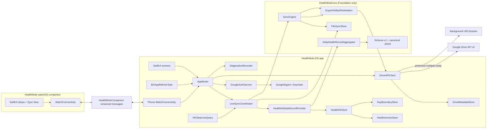

# Architecture

Health Mule separates deterministic export, sync, and companion-message
contracts from iOS/watchOS platform adapters.



Solid arrows are implemented runtime paths.

## Current implementation

| Area | Current contract |
|---|---|
| App shell | An adaptive SwiftUI tab shell keeps Home and Settings as permanent destinations. Setup, sync repair, and per-metric status are focused Home drill-ins, preserving the four required product screens without giving one-time workflows permanent tab weight. `AppModel` owns observable UI state and platform services. |
| Schema | `HealthMuleCore` encodes explicit JSON `null` values, validates local dates and offset-bearing timestamps, preserves unknown fields, and emits canonical sorted JSON. |
| Aggregation | Pure Swift inputs cover latest values, stable arithmetic means, asleep-interval unioning, workout de-duplication, derived totals, and deterministic source ordering. |
| Durable sync | `SyncEngine` and `FileSyncStore` implement semantic no-op detection, artifact revisions, a persistent retry queue, manifest ordering, retry backoff, reauthorization blocking, and full republishing when the destination account or managed folder identity changes. |
| Reconciliation | `LiveSyncCoordinator` combines enabled-metric anchored deltas, a rolling three-day window, missing dates from the fixed selected backfill boundary, and existing dates that need metric-selection scrubbing. It stages each date before committing anchors. |
| HealthKit | A dedicated `HealthKitClient` actor keeps queries, sample transformation, aggregation, and anchor/day-boundary persistence off the UI actor. The app requests read access only, tracks the authorization-request lifecycle without claiming to know individual read grants, distinguishes a failed status check from a completed request, reports last readable samples, registers observer queries, fetches anchored deltas, preserves original day boundaries, and builds daily records with HealthKit statistics and sample queries. |
| Google | GoogleSignIn restores and refreshes credentials, distinguishing a revoked grant, an account change, and a temporary network failure. OAuth authorization and verified Drive readiness are separate states. Every token refresh and Drive request is bound to its expected stable account ID. `DriveArtifactDestination` maps core artifacts and retry classifications onto account-scoped folder discovery and stable-ID multipart upserts. |
| Watch companion | A watchOS 11 SwiftUI app receives a sanitized versioned status snapshot and sends an idempotent sync request through reachable Watch Connectivity messaging. The action is disabled while the iPhone is unavailable. The iPhone owns the sync state machine and publishes the latest status through application context. |
| Background refresh | The app registers a SwiftUI `BGAppRefreshTask` handler, bootstraps the same services if launched cold, and submits a best-effort request with a one-hour earliest start. |
| Reporting | `AppModel` exposes operation-specific results, retryable and permanently blocked upload counts, the latest locally staged date, the last successful manifest upload for the active destination, per-metric readability, and redacted sync counts. |
| Diagnostics | A bounded in-memory recorder emits redacted lifecycle metadata through `OSLog` and a shareable JSON file. |

`AppModel.live()` constructs the daily provider, protected staging root,
`FileSyncStore`, `SyncEngine`, and Drive destination through
`LiveSyncCoordinator`. Manual, launch, foreground, rebuild, retry, observer, and
app-refresh triggers feed that same state machine. The UI distinguishes staged,
uploaded, pending, and failed work; a successful manifest upload advances the
last-successful timestamp.

`PhoneWatchConnectivityCoordinator` activates with the iPhone app model. It
maps app state into `CompanionSyncSnapshot`, which contains only readiness,
sync activity, timestamps, and queue counts. It never includes health values,
record bodies, Google account details, Drive IDs, tokens, or diagnostic error
strings. Watch requests feed the existing reconciliation path with the
`watchCompanion` trigger; repeated delivery remains safe because reconciliation
and Drive upserts are idempotent.

`DriveAPIClient` uses an in-process session for metadata operations and a
dedicated background `URLSession` for multipart uploads. Upload bodies are
protected, backup-excluded files; task descriptions retain only opaque SHA-256
destination and operation keys plus a local filename. Activating or clearing a
Drive destination first invalidates the client state, then drains tasks with an
old or unknown destination key to a definitive HTTP response before publishing
the new state. Client-side cancellation is not considered proof that Drive did
not accept an upload. A definitive delegate completion drains an obsolete task
even when its HTTP or transport result failed; the durable queue reconciles
that failure separately. Only expiry of the local drain observation window,
which means the transfer may still be running, leaves the destination
unprepared and temporarily unavailable for a later retry. Tasks for the same
destination key survive a reconnect. In-process calls reserve their logical
operation before suspending: identical operations share one transfer, while
different operations start in FIFO reservation order. The matching SwiftUI
background task reconnects the session after relaunch, waits for delegate event
delivery, and then feeds the result back through the durable reconciliation
queue. Google OAuth, real Drive, physical-device HealthKit, and
process-interruption behavior remain unverified until their external
configuration is supplied.

At the Drive client boundary, concurrent setup calls for one account share a
single managed-folder discovery/create operation. Artifact upserts reserve a
FIFO lane per account, destination, and logical artifact key before their first
suspension. This preserves distinct body revisions in call order and prevents
two uncached calls from generating competing Drive file IDs.

## Export and sync invariants

The Foundation-only core owns the invariants that must remain independent of
HealthKit and Google:

1. A daily artifact has the logical identity `daily:<yyyy-mm-dd>` and the path
   `daily/<yyyy-mm-dd>.json`; the manifest has the identity `manifest`. Once a
   date exists, its stored timezone remains authoritative when it is restaged.
2. Missing metrics and optional workout values encode as explicit JSON `null`.
3. Unknown fields from a prior record survive a decode, update, and re-encode.
4. Known decimal measurements use nearest rounding to at most two fractional
   digits, with exact half values away from zero, before totals, semantic
   comparison, and encoding. Unknown numeric values use exact Foundation
   `Decimal` storage through 38 significant digits; wider coefficients are
   rejected lexically rather than rounded. Semantic equality also ignores
   `generatedAt` and normalizes collection order, so insignificant HealthKit
   floating-point noise does not create a revision.
5. A manifest is staged only when every local daily revision is current
   remotely.
6. Transient failures enter exponential backoff with jitter and normal launch,
   foreground, observer, and background reconciliations respect their deferred
   retry dates. The explicit Retry action may bypass that delay. Authorization
   failures resume only after valid credentials are restored. Permanent failures
   remain blocked and are not presented as retryable.
7. A different Google account or a replacement managed folder tree is a
   different remote destination. Before that destination can sync, every local
   daily artifact is atomically marked pending, prior manifest delivery state is
   discarded, and the last-successful timestamp is cleared. The destination
   receives the complete local snapshot and a fresh manifest.
8. `LiveSyncCoordinator` uses one FIFO single-flight gate for reconciliation,
   observer staging, uploads, and reset. The core actors protect their own state
   while that gate preserves whole-operation ordering across actor suspension.
9. Daily artifact bytes are written before their state revision is committed.
   If that second write fails, the next same-process attempt or process reopen
   detects a semantic or exact-byte mismatch, advances the revision, and
   restores the retry item before reporting the record unchanged.

`HealthKitDailyRecordProvider` uses HealthKit statistics for cumulative values,
maps authorized samples into `DailyAggregationInput`, and passes the result to
the deterministic aggregator. `LiveSyncCoordinator` stages every affected date
durably before committing each new `HKQueryAnchor`; a later upload failure
remains represented in the persistent retry queue.

Each reconciliation includes the current local day and up to two previous days
without crossing the selected backfill start. It also stages anchored change
dates and any missing day between the selected start and today. The selected
start is persisted as a validated `yyyy-MM-dd` local-date value when the user
picks a range, so “Last 30 days” does not slide forward at midnight or change
while traveling. If that persisted local date is temporarily ahead of today
after a timezone change, reconciliation waits instead of moving the boundary
backward. Metric and history controls are disabled while visible work is active.
Every accepted selection change schedules reconciliation; if a change races an
active sync, one serialized follow-up pass consumes the latest settings.
Backfill work is persisted one day at a time, so an interrupted run resumes from
dates not already present in `FileSyncStore`. Observer staging and an explicit
Retry also include missing selected-range dates, so either path can heal a
historical gap.
An incremented export-contract revision re-stages every existing date once,
durably requeues every otherwise-current daily artifact, and upserts them by
Drive ID. This applies normalization changes and repairs remote-only gaps
without deleting local recovery state.

## HealthKit authorization

`HealthKitClient` requests an empty write set and only the currently enabled
subset of the nine read types listed in the
[product specification](specs/healthkit-drive-exporter.md). It persists which
types have completed the system request so newly enabled types return setup to
**Review needed** before queries, observers, or exports include them.

HealthKit deliberately does not reveal whether a person denied read permission.
`authorizationStatus(for:)` describes permission to save data, not permission to
read it. The app separates the system request lifecycle from the evidence
available through read queries.

The overall Apple Health state is:

- **Checking** — the app is asking HealthKit whether an authorization sheet is
  currently needed.
- **Check failed** — HealthKit did not return the request status. If a request
  was completed previously, visible types remain queryable; otherwise sync
  stays blocked until the check or request succeeds.
- **Not requested** — the app has not completed its first authorization
  request.
- **Review needed** — HealthKit says an authorization sheet is needed for at
  least one requested type. Previously visible types remain queryable.
- **Request complete** — HealthKit says no authorization sheet is currently
  needed. This does not confirm which individual read permissions were granted.
- **Unavailable** — HealthKit is not available on this device.

After a request has been made, each metric is reported independently as:

- **Checking** — the visibility query is in progress.
- **Not included** — the type is disabled in Settings and is not queried.
- **Not requested** — the type is enabled but has not completed the system
  request yet.
- **Readable** — at least one visible sample exists, with its last sample date.
- **No readable data** — the type is denied or no matching sample is visible;
  the app cannot distinguish those states.
- **Check failed** — the query itself failed, rather than returning no samples.
- **Unavailable** — HealthKit cannot be queried on this device.

See Apple’s [HealthKit authorization
documentation](https://developer.apple.com/documentation/healthkit/authorizing-access-to-health-data).
The UI never presents readable-type counts as permission progress.
UI metric switches control the app's request, query, observer, and export
selection; they do not claim to revoke system Health permissions already
granted. Disabled metrics skip HealthKit access and serialize as `null` or empty
approved collections. When the selection changes, every existing local date is
rebuilt so previously staged values from disabled metrics are scrubbed before
the next Drive upsert. Settings prevents changes during a visible operation;
each accepted change also queues a serialized reconciliation, including a
follow-up pass if the selection changes while another sync is suspended.

Observer queries are registered as bootstrap's first asynchronous action, but
only for enabled types that have completed the system request.
`HealthAnchorStore` archives one anchor per metric and keeps a
UUID-to-date index so a later `HKDeletedObject` can identify an older affected
day. Enabled observations stage their affected dates plus the rolling
reconciliation window, commit the anchor, and attempt to flush pending uploads
when Google is connected. Concurrent observer uploads use a single-flight
drain: requests received during one upload produce at most one follow-up pass,
while every observer still waits for its own durable staging before completing.
New sample mappings are persisted and published to the live store before the
anchor, while deletion mappings are retained until that anchor is durable; an
interrupted anchor write therefore replays the deletion with its affected date
still available both immediately and after a relaunch.

Bootstrap resolves the Apple Health request state before replaying any pending
uploads unblocked by restored Google credentials. A non-empty restored queue is
shown as active sync work instead of leaving Health on `Checking` while Drive
uploads run.

Initial anchored reads are scoped to the selected history start and paged in
bounded batches. Each metric persists that query boundary with its anchor; an
expanded history window resets that metric's anchor and safely replays from the
earlier boundary. The active selected start remains the VO₂ carry-forward lower
bound even when older staged artifacts remain available for repair after a
range is narrowed.

`DayBoundaryStore` persists the timezone and exact start/end instants first used
for an exported local date. Later travel therefore does not reinterpret or
rename an existing daily record. Persisted boundaries from builds that carried
a midnight-DST end into the following day are normalized once using their
original timezone. The backfill boundary resolves through this same store before
HealthKit queries begin. New or normalized boundaries are published to in-memory
state only after their atomic file write succeeds.

Sleep queries include a 24-hour lookback plus a bounded four-hour look-ahead so
sessions crossing midnight can be clustered. A cluster is not eligible until
four hours have elapsed since its latest fragment, preventing an incomplete
pre-midnight fragment from being published on two adjacent dates. Anchored
sleep additions, edits, and deletions rebuild both their directly overlapped
dates and the following plausible session-ending date; the direct UUID/date
mapping remains durable so deletion replay applies the same bounded expansion.
Record provenance includes only samples from the cluster whose session ends on
the exported day, so earlier lookback sessions do not inflate source names or
sample counts. When a VO₂ value is carried forward, its selected source sample
is included in provenance and de-duplicated from same-day samples by UUID.

## Google Drive identity

The remote layout is:

```text
Apple Health Sync/
├── manifest.json
└── daily/
    └── YYYY-MM-DD.json
```

Drive names are not unique. Google authorization is also not sufficient by
itself to begin syncing. `GoogleConnectionState` keeps restoration, temporary
unavailability, reauthorization, OAuth-authorized folder setup, Drive
unavailability, and fully connected states distinct. **Connected** means all of
the following are true:

1. GoogleSignIn restored or obtained the `drive.file` scope.
2. Google supplied a stable user ID for the active account.
3. The managed root and `daily` folders were recovered or created for that
   account.
4. The account was activated for subsequent file upserts without a newer
   disconnect or account transition superseding it.

Sync readiness additionally requires protected local staging to be available.
If local storage initialization fails, the Google card can remain accurately
Connected while the Home and Sync surfaces report a blocking storage error.

`DriveAPIClient` then uses:

- immutable Drive file and folder IDs cached per Google account by
  `DriveMetadataStore`;
- folder validation by MIME type and trash state, plus a present My Drive
  parent for a rediscovered root and the `daily` folder's exact root parent;
- private `appProperties` named `healthMuleKind` and `healthMuleDate`;
- Drive-generated IDs supplied on create, making an ambiguous retry resolve as
  either a successful create or `409 Conflict`;
- `PATCH` multipart uploads for updates by file ID.

Generated file IDs are persisted as `pendingCreate` before upload and become
`committed` only after a definitive successful response. This state survives
relaunch: a validation `404` reuses a pending ID because its create may still
be completing, while a validation `404` for a committed ID clears that stale
cache entry and allocates a fresh ID after tagged-file rediscovery.

Each metadata namespace is keyed by the SHA-256 digest of the stable Google user
ID. The raw ID is neither used as a `UserDefaults` key nor logged. Legacy
unscoped v1 metadata is intentionally ignored instead of being assigned to an
unknown account; the app rediscovers managed folders and files through their
private `appProperties`. Root discovery is not constrained to the top-level
`root` parent, so a user-moved tree is recovered instead of duplicated; daily
folder discovery remains constrained to the verified root ID.

The app also persists a SHA-256 destination namespace derived from the stable
account ID plus the verified root and `daily` folder IDs. When it changes,
`LiveSyncCoordinator` resets only remote-upload completion state: local daily
files and HealthKit anchors remain intact, every local day is queued for the
new destination, and a new manifest is generated after those daily files
upload. Replacing a deleted or trashed folder therefore republishes the same
complete snapshot as switching accounts. The metadata transition clears stale
file IDs atomically, and generation-checked cache writes prevent an older
in-flight upload from restoring them.

The reset and namespace update run behind the coordinator’s single-flight gate.
Drive requests carry their expected account ID through token refresh, and
`AppModel` epochs every connection transition and activation. A late response
from an older account can update neither the current connection status nor the
new account’s active Drive destination.

Moving the configured folder within My Drive continues to work by immutable ID.
Reset Local Sync State preserves Drive folder and file IDs plus saved local-day
boundaries while clearing local HealthKit anchors, staged records, the local
manifest, and retry state. The next sync rebuilds the selected local range.
Previously exported Drive files outside that rebuilt range are intentionally
not deleted and may no longer appear in the new manifest.

## Persistence and privacy

| Data | Current storage | Boundary |
|---|---|---|
| Google OAuth credentials | GoogleSignIn-managed Keychain state | Never log, export, or duplicate tokens in app storage. |
| Drive folder and file IDs | Per-account `UserDefaults` namespaces through `DriveMetadataStore` | Namespaces use a SHA-256 digest of the stable Google user ID. IDs contain no record bodies; diagnostics must still treat them as private. |
| Prepared Drive destination | SHA-256 digest of account, root-folder, and daily-folder identity in `UserDefaults` | Used only to detect destination changes and force a complete republish; raw identifiers are not stored in this key. |
| Metric switches and backfill selection | `UserDefaults` | Preferences only, with no health values. |
| HealthKit anchors and UUID/date index | Application Support under `HealthMule/Anchors` | Uses complete-until-first-authentication file protection and is excluded from backups. |
| Saved local-day boundaries | Application Support under `HealthMule/day-boundaries.json` | Uses complete-until-first-authentication file protection and is excluded from backups. |
| Daily records, manifest, and retry state | Application Support under `HealthMule/Staging` through `FileSyncStore` | The staging root uses complete-until-first-authentication protection and is excluded from backups before records are written. |
| Diagnostics | Bounded memory plus an explicit temporary share file | A closed typed event enum is the export allowlist. Callers cannot supply arbitrary categories, event names, field keys, raw errors, identifiers, metadata, or health values. |

The no-backup rule is part of the product boundary: Apple’s [App Review
Guidelines](https://developer.apple.com/app-store/review/guidelines/) prohibit
storing personal health information in iCloud. It also keeps the user’s selected
Google Drive folder as the only remote export location.

The privacy manifest declares Health and Fitness data as linked because exports
are uploaded to the authenticated user’s Drive account. Both categories are
used only for app functionality, never for tracking; the required-reason
declaration for `UserDefaults` remains in place.

## Background execution

Background work is eventual and system-controlled:

- HealthKit observers are the primary change signal.
- A reachable Watch request is acknowledged promptly, then the iPhone performs
  reconciliation and republishes status.
- The Watch action is disabled while the iPhone is unreachable; background
  status delivery remains eventual through application context.
- `BGAppRefreshTask` is a fallback reconciliation opportunity.
- A cold background launch first restores services and credentials through the
  same bootstrap gate used by the foreground app.
- Foreground activation requests another reconciliation.
- Observer callbacks durably stage changes before completing their anchored
  batch, then attempt an upload while the process still has execution time.
- Each multipart body is staged as a protected, backup-excluded file and sent by
  a background `URLSession`. A stable session identifier and matching SwiftUI
  background task reconnect delegate delivery after a system relaunch.
- The foreground/background reconciliation observes a scheduled transfer for
  at most 15 seconds. If connectivity is still unavailable, it detaches its
  waiter without canceling the system-owned upload, records a retryable timeout,
  and releases the coordinator gate while the durable task continues.
- Pending tasks are serialized across relaunch. If a transfer finishes without
  its original in-process waiter, the durable queue retries the same
  pre-generated Drive file ID and reconciles idempotently.
- Because a bearer token can expire while a background task waits for
  connectivity, the first upload `401` obtains a refreshed token and retries
  once. A repeated `401` remains a reauthorization failure.

Apple notes that HealthKit background observer queries require a physical
device, and background `URLSession` uploads that must survive process exit need a
file-backed upload task. See [executing observer
queries](https://developer.apple.com/documentation/healthkit/executing-observer-queries)
and [background URLSession
transfers](https://developer.apple.com/documentation/foundation/downloading-files-in-the-background).

## Build and verification boundaries

`project.yml` is the XcodeGen source of truth for the generated
`HealthMule.xcodeproj`. GoogleSignIn is pinned exactly in `project.yml`; the
shared workspace `Package.resolved` is explicitly retained by `.gitignore` so
the resolved transitive graph can be committed with the project.
`scripts/check-app-dependencies.sh` verifies those versions match without
network access, while the weekly Dependency Watch workflow compares the pin to
Google's latest official release and opens one advisory issue per target
version.

To update GoogleSignIn, edit its `exactVersion` in `project.yml`, regenerate the
project, resolve the package graph, run the offline dependency check, then run
the full gate. Do not hand-edit generated project structure or lock entries:

```sh
make project
./scripts/with-xcode-lock.sh ./scripts/xcodebuild.sh -resolvePackageDependencies -project HealthMule.xcodeproj -scheme HealthMule
./scripts/check-app-dependencies.sh
make verify-full
```

The canonical development commands are:

```sh
make project
make test-infra
make test-core
make build
make test
make smoke
make run
make verify
make verify-full
```

`make verify` is the fast cross-platform gate: it checks the serialized tooling
contract, parses all app and iOS test Swift, and runs the deterministic
Foundation package tests. Required CI runs that target on Linux.
`make verify-full` adds the iOS app and UI tests on an available Simulator and
is available through the manual `Full Verify` workflow.
Neither command proves HealthKit authorization, observer delivery, Google OAuth,
Drive uploads, or background relaunch behavior; those belong to the
[physical-device checklist](DEVICE_TESTING.md).

## Remaining integration gaps

- Configure and exercise Google OAuth against a real Drive account.
- Prove file-backed Drive upload interruption and relaunch reconciliation on a
  physical device.
- Prove HealthKit authorization, queries, observer delivery, and reconciliation
  on a signed physical-iPhone build.
- Surface granular day-by-day progress for a long custom backfill.
